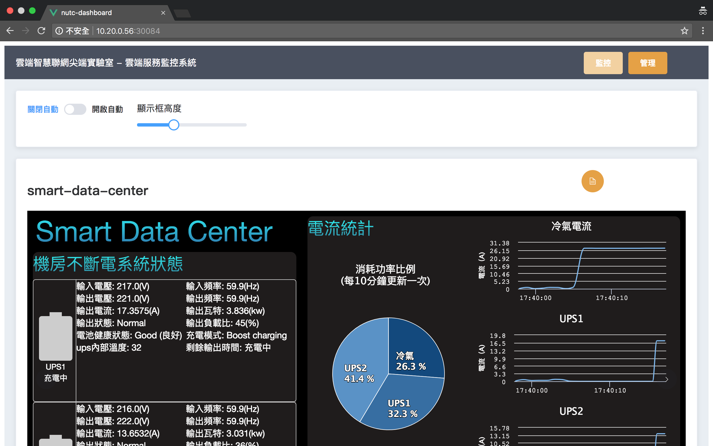

# ESICL

This project is dashboard of service in Emerging Smart IoT Computing System Lab (ESICL). Including ICINGA, Kubernetes, Etherum and Smart Data Center.



## Requirment

`nodejs` > 8.0 

## Setup

First, you need to create a service account of admin-user in kubernetes. and then bind a cluster role of cluster-admin for new service account.

```
# Create a admin-user-sa.yaml in kubernetes master. 
# Then add follow codes in file and save.
vim admin-user-sa.yaml

apiVersion: v1
kind: ServiceAccount
metadata:
  name: admin-user
  namespace: kube-system
  
# And then Create a admin-user-crb.yaml in kubernetes master.
# Bind cluster-admin of cluster role for new serivce account.
vim admin-user-crb.yaml

apiVersion: rbac.authorization.k8s.io/v1beta1
kind: ClusterRoleBinding
metadata:
  name: admin-user
roleRef:
  apiGroup: rbac.authorization.k8s.io
  kind: ClusterRole
  name: cluster-admin
subjects:
- kind: ServiceAccount
  name: admin-user
  namespace: kube-system
  
# Finally, use kubectl to create them.
kubectl create -f admin-user-sa.yaml
kubectl create -f admin-user-crb.yaml
```

Then, you can use command to get token from secret component in kubernetes.

```
kubectl describe secret -n kube-system
```

Copy `env.example.js` and set it.

```
# Copy env.js from env.example.js
cp env.example.js env.js

# Modify your env.js
vim env.js

# Set kubernetes master ip and admin token for your env.js
...
const kubernetes = {
  admin: {
    token: '<admin-token>'
  },
  master: {
    ip: '<k8s-master-ip>
  }
}
...

#Finally, use command to setup it.
npm install -g
```

## Usage

```
esicl build
```

> If you need any helps. you can use `esicl -h` commnad

## Remove

```
esicl clean
```


